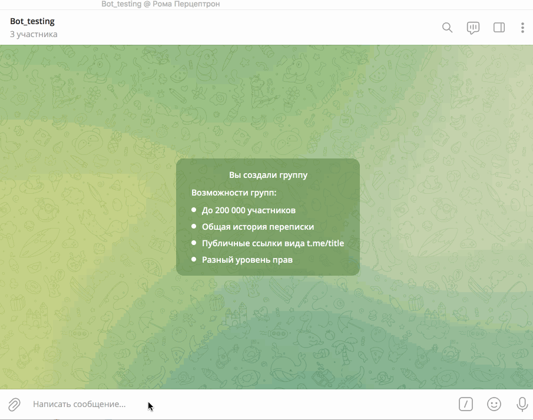

---

###Рома Перцептрон
### Email: roma.perceptron@gmail.com
###Telegram: [@roma_perceptron](https://t.me/roma_perceptron)

##KTS COURSE PROJECT BOT

Игра "Что? Где? Когда?", но вместо телезрителей - chatGTP. Нейросеть не только придумывает вопросы, но и проверяет ответы знатоков.

Играть можно как в одиночку, так командой. Для этого добавьте бота в свою группу с правами администратора.

Для начала игры кто-то должен вызвать команду /start. Далее все желающие присоединяются к игре и когда состав готов (так же может быть и один человек), тот кто стартовал игру ее же и запускает.

После этого, случайным образом будет выбран капитан игры и начат первый раунд с первым вопросом. Игроки получают минуту времени на обсужжение, по истечении которой ведущий попросит капитана выбрать игрока который даст ответ. Так же можно будет ответить досрочно.

Игрок которому капитан поручит ответ должен написать его в ответ на сообщение бота. На написание ответа так же отводится минута. Бот проверит ответ и сообщит свое решение, а так же промежуточный счет. Начнется следующий раунд.

Игра идет до тех пока одна из сторон не наберет 6 очков, максимум 11 раундов.

В процессе игры участники могут свободно обмениваться сообщениями в чате.
Не слишком надейтесь на этот искусственный интеллект, он способен выдавать как некорректные вопросы, так и неверные ответы 😏
